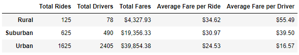
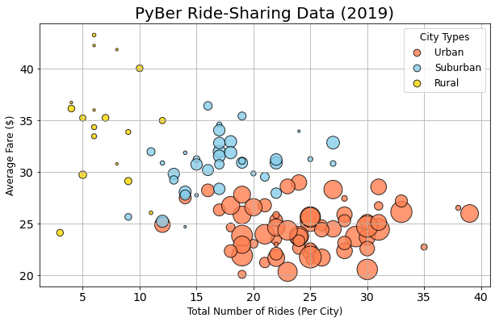
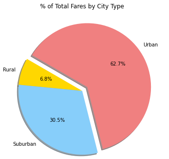
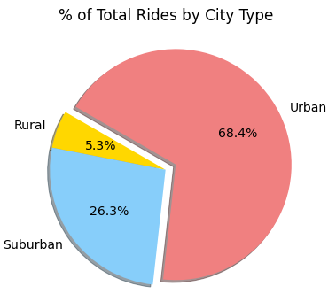
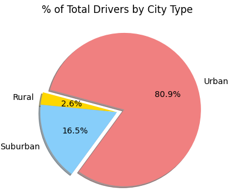
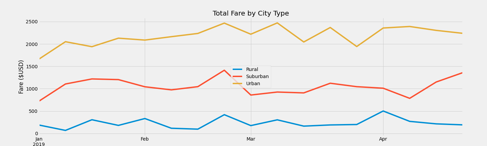

# PyBer_Analysis
Analyzing Ride Share information with Python

## Resources
- Python 3.8.5
- Jupyter Notebook 6.3.0
- Pandas 1.2.4 
- MatplotLib 3.3.4
- **Data Sources**: city_data.csv, ride_data.csv (found in Resources folder)

## Project Overview
The purpose of this analysis is to provide the company PyBer with a comparison on customer fares for ride-sharing for decision making. This analysis will compare how much customers pay based on the type of city they live in (Rural, Suburban or Urban). 

## Results

### **Ride Share Data**: 

The scatter plot below and the table above show the span of the data. The total number of rides are the highest in the urban areas and the lowest total in the rural areas. The size of the bubbles and the small table above both show, that in the Urban areas there were also the most drivers. However when looking at the yellow dots which indicate the Rural area, you can see that Rural cities average the highest cost in fares. 

### **Data Visualized by City Type**:

The 3 Pie graphs below also show a visual representation of the percentage of each type of city in relation to fares, rides and drivers. 

**Fare**

**Rides**

**Drivers**

In the last pie graph you can see there is an increase in the Urban category by 12.5% in comparison to the % of total rides and an increase of 18.2% in the % of total fares. . This shows that Urban cities have the greateast amount of riders and this area respectively shows the greatest difference in correlation to the other 2 metrics (fares and rides).

### Total Fare by City Type

This line graph shows the total fares from January 2019 to April 2019. The line graph shows each area and their fares. You can clearly see here that Urban Cities collect the most fares, followed by Suburban and then lastly Rural. The 3 lines do seem to follow a similar patterns of increases and decreases. This can be due to seasons, events, etc. 

## Summary

Through the analysis you can see rural areas have the most expensive rides and urban areas have the cheapest. This can be directly related to the amount of riders and drivers available, as well as the short distances from area to area. In urban areas there often is a sentiment of quick travel from place to place, not to mention tourism which can also boost numbers. Due to possibly high number of riders and shorter distances, the cost of the rides in urban areas are the lowest while rural areas can show the inverse due to opposite factors. A possible way to increase ridership in rural areas is to possibly offer discounts to riders since these areas are known to have the highest prices. Surburban areas seem to stay in the middle of all the charts and data which can indicate that a different level of possible marketing or advertising could impact the amount of rides that occur. Offereing some form of an incentive or bonus to the drivers for completing rides could increase the amount of drivers which could then increase rides. Many different conclusions can be drawn from this data but more information in cohesion with this data would make it more telling. For example: gaining access to traveler information, distances traveled on rides and population density of the area could provide valuable insight for business decisions. If that data could be accessed and combined with the data gathered here, different avenues could be researched to increase revenue as well as customer loyalty and usage. 

